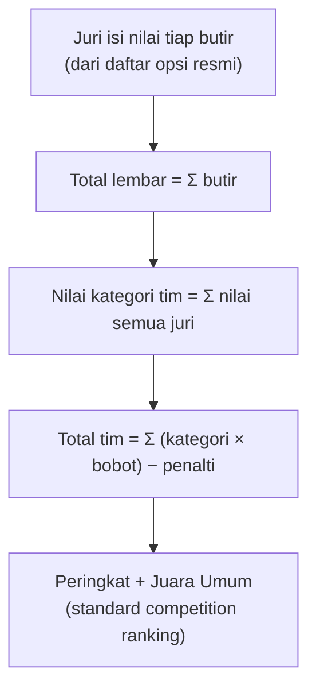
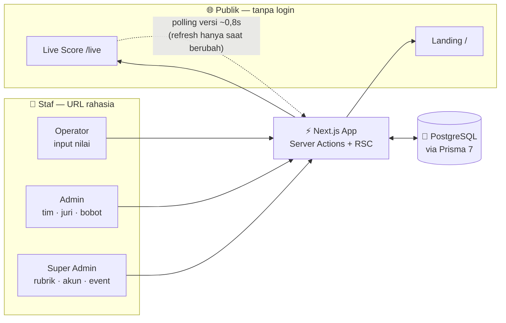

<div align="center">


# Paskitactical

### Penilaian &amp; rekapitulasi lomba — **cepat, transparan, real-time.**

Ubah rekap manual yang memakan waktu berjam-jam menjadi hitungan **instan** —
untuk **lomba apa pun** yang penilaiannya bernilai angka.

<br/>


**[✨ Fitur](#-fitur-unggulan)** · **[🧮 Cara Kerja](#-cara-perhitungan)** · **[⚡ Mulai Cepat](#-mulai-cepat)** · **[🏗️ Arsitektur](#️-arsitektur)** · **[🔐 Keamanan](#-keamanan)**

</div>

---

**Paskitactical** membantu panitia menghitung nilai lomba — dari input juri per butir hingga
penentuan **Juara Umum** — secara otomatis. Rubrik penilaian **100% dapat diatur sendiri lewat
aplikasi** (tanpa menyentuh kode), sehingga satu sistem bisa dipakai untuk lomba baris-berbaris,
tari, cerdas cermat, robotik, masak, debat, dan lomba bernilai angka lainnya.

> Penonton memantau **skor langsung** yang diperbarui **hampir seketika**, sementara panitia
> fokus menyalin nilai dari lembar juri — total, peringkat, dan juara terhitung otomatis.

<br/>

## ✨ Fitur unggulan

| | |
|---|---|
| 🧩 **Rubrik fleksibel** | Susun kategori, grup, butir, dan daftar pilihan nilai sepenuhnya dari UI. Cocok untuk format apa pun. |
| ⚡ **Live score real-time** | Papan skor publik menyegar otomatis **≤ 0,8 detik** setiap ada perubahan — tanpa membebani server. |
| 🏆 **Juara Umum otomatis** | Dua metode: akumulasi nilai (× bobot) atau poin medali. Peringkat & seri dihitung otomatis. |
| 🔍 **Transparan** | Rincian nilai per butir dari tiap juri tersedia untuk staf; peserta bisa diperlihatkan salinannya. |
| 👥 **Multi-peran & multi-akun** | Super Admin membuat akun operator; semua tersinkron dalam satu basis data — anti input dobel. |
| 🔒 **Anti-manipulasi** | Nilai divalidasi ulang di server, lembar final terkunci, setiap aksi tercatat di audit log. |
| 🌗 **Mode terang/gelap** | Antarmuka rapi, responsif, tanpa kedip (no-FOUC), siap dipakai dari ponsel juri. |
| 📤 **Ekspor terkontrol** | Unduh CSV / cetak PDF **khusus Super Admin**; publik hanya melihat ringkasan. |

<br/>

## 🧮 Cara perhitungan

```
Nilai lembar   = Σ nilai tiap butir            (hanya nilai dari daftar opsi resmi)
Nilai kategori = Σ nilai semua juri di kategori itu
Total tim      = Σ (nilai kategori × bobot kategori) − penalti
Juara Umum     = peringkat berdasar total (atau poin medali)
```



- Setiap butir **hanya menerima nilai dari daftar resminya**; nilai lain ditolak server.
- Peringkat memakai *standard competition ranking* (nilai sama berbagi peringkat: 1, 2, 2, 4).
- Tim dengan nilai identik ditandai **SERI** — pemenang ditentukan keputusan juri.
- Bobot tiap kategori dapat diubah kapan saja, termasuk mengeluarkannya dari Juara Umum.

<br/>

## 👥 Peran &amp; akses

| Peran | Kewenangan |
|---|---|
| **Super Admin** | Semuanya: rubrik, akun, identitas event, metode Juara Umum, ekspor CSV/PDF, reset. |
| **Admin** | Kelola tim, juri, dan bobot kategori. Tidak bisa mengubah struktur rubrik. |
| **Operator** | Memasukkan & memfinalkan nilai (dan penalti). Tidak melihat menu Pengaturan. |
| **Viewer** | Hanya melihat. |

Staf masuk melalui **URL rahasia** yang terpisah dari halaman publik:

| Rute | Untuk | Akses |
|---|---|---|
| `/` | Landing publik | Semua orang |
| `/live` | Skor langsung (ringkasan) | Semua orang |
| `/admin=-000` | Login Super Admin / Admin | Rahasia |
| `/operator=-000` | Login Operator | Rahasia |

> Publik **hanya** melihat ringkasan peringkat. Rincian nilai per butir & ekspor salinan
> (CSV/PDF) hanya dapat diperlihatkan oleh Super Admin bila diminta.

<br/>

## ⚡ Mulai cepat

**Prasyarat:** Node.js 22, PostgreSQL.

```bash
# 1. Dependensi
nvm use                 # Node 22 (dari .nvmrc)
npm install

# 2. Konfigurasi (rahasia — TIDAK di-commit)
cp .env.example .env
#   isi DATABASE_URL dan AUTH_SECRET (buat: openssl rand -base64 32)

# 3. Siapkan database + akun super admin
npm run db:push         # buat tabel dari schema
npm run db:seed         # muat rubrik contoh + akun admin awal

# 4. Jalankan
npm run dev             # http://localhost:3000
```

Butuh data latihan? `npm run demo -- --reset` mengisi 5 tim, 6 juri, dan nilai contoh.
Hapus lagi dengan perintah yang sama sebelum lomba sungguhan.

<br/>

## 🏗️ Arsitektur



**Sorotan teknis:**

- **Live tanpa boros** — klien memantau endpoint *versi* super-ringan (agregat terindeks, di-cache
  400 ms). Render ulang penuh hanya terjadi saat data benar-benar berubah, jadi ratusan penonton
  pun tidak membanjiri server.
- **Server-authoritative** — semua nilai divalidasi ulang terhadap rubrik di server (Server Actions);
  klien tidak dipercaya.
- **Prisma 7 + driver adapter** (`@prisma/adapter-pg`) dengan koneksi via `prisma.config.ts`.
- **Auth tanpa dependensi berat** — JWT `jose` (HS256) pada cookie `httpOnly`, bcrypt 12 putaran.

<br/>

## 🔐 Keamanan

- Kata sandi disimpan sebagai **hash bcrypt** (12 putaran) — tidak pernah plaintext.
- Sesi memakai **JWT HS256** pada cookie `httpOnly`, `sameSite=lax`, `secure` di produksi.
- Percobaan login **dibatasi** untuk meredam brute force.
- Seluruh nilai **divalidasi ulang di server** terhadap daftar opsi resmi; nilai palsu ditolak.
- **Lembar final terkunci** untuk operator; hanya Admin+ yang bisa mengoreksi.
- Setiap perubahan penting dicatat di **AuditLog** (siapa, kapan, berapa).
- Ekspor CSV memberi awalan kutip pada sel berawalan `= + - @` untuk mencegah **CSV injection**.
- **Rahasia tidak pernah masuk repo:** `.env` di-`.gitignore`; hanya [`.env.example`](.env.example)
  (berisi placeholder) yang dibagikan.

<br/>

## 📁 Struktur proyek

```
prisma/
  schema.prisma        Skema basis data (Event, Team, Judge, Rubrik, ScoreSheet, ...)
  rubric.ts            Rubrik contoh (template awal, bisa diubah dari UI)
  seed.ts              Seed akun admin + rubrik + data demo opsional
src/
  app/
    page.tsx           Landing publik
    live/              Skor langsung publik + polling versi
    (app)/             Area staf: input, rekap, penalti, pengaturan
    admin=-000/        URL rahasia login super admin/admin
    operator=-000/     URL rahasia login operator
    api/live/version/  Endpoint sidik-jari data untuk live real-time
    api/rekap/csv/      Ekspor CSV (khusus Super Admin)
  lib/
    scoring.ts         Agregasi nilai, penalti, peringkat, deteksi seri
    auth.ts            Sesi, peran, pembatas login
```

<br/>

## 🚀 Deployment

Berjalan di mana pun Node.js tersedia. Untuk instance **selalu-aktif** dengan URL publik,
jalankan `npm run build && npm run start` di bawah manajer proses (mis. `systemd`) lalu
ekspos lewat **ngrok** atau **Cloudflare Tunnel**. Tanpa perlu database cloud —
cukup PostgreSQL lokal.

<br/>

## 📄 Lisensi

Dirilis di bawah lisensi [MIT](LICENSE) — bebas dipakai, ubah, dan sebarkan.

<br/>

<div align="center">

Dibuat dengan ❤️ oleh **[Muhammad Rizal Haris](https://www.instagram.com/mhmmddrizal/)**

<sub>Paskitactical — satu sistem, semua jenis lomba bernilai angka.</sub>

</div>
